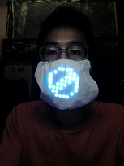
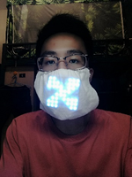
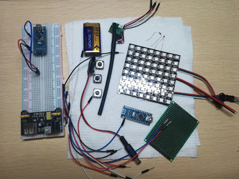
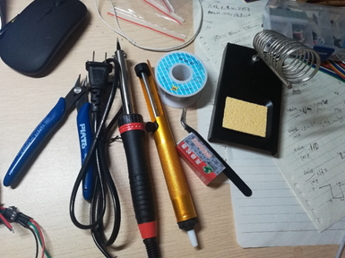
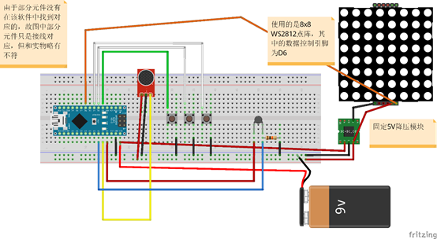
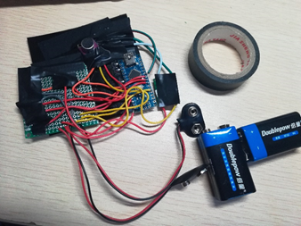
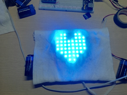
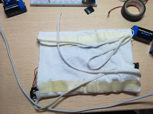

# Voice Mask

该面罩是基于Arduino Nano制作的一款声控灯光面罩，面罩的灯光图案可以根据声音的变化而变化，模仿说话时的嘴部动作，另外还能通过声音控制显现一个简单的微笑。附带有颜色随身边温度变化、颜色自定义、静态图像切换的小功能。（[*演示视频*](./video/voiceMask.mp4)）

## 功能介绍

### 1. 显示模式

显示模式有两种：动态和静态。
a) 动态模式下说话时图案会根据声音大小不同进行不同的变化，当发出一个短促的声音并且一定时间内无其他声响，会显露一个“微笑”；（[*演示视频*](./video/voiceMask.mp4)）
b) 静态（禁言）模式下可以切换三种静态图像：“禁止标志”、风车、爱心



### 2. 颜色模式

颜色模式有两种：温变模式和自定义模式。
a) 温变模式下，颜色会时刻根据当下温度进行变化：随着温度升高灯光颜色偏向暖色调，随着温度降低灯光颜色偏向冷色调，可以间接的反应温度变化（y源代码中将温度区间设置为10到40摄氏度）；\
b) 自定义模式下可以自定义当前颜色，这种模式下颜色固定为所调节的颜色（颜色范围为彩虹色，没有白光）

### 补充说明

a) 以上个功能（模式）的切换和使用通过面罩上的按钮进行；\
b) 每次断电后开发板会记住上次断电前面罩所处状态；\
c) 该程序由两个程序组成:主程序和附属程序。附属程序“putDataIntoEEPROM.ino”用于向EEPROM写入一些状态值，以设置默认的初始状态（对于未下载过该程序的开发板最好先下载“putDataIntoEEPROM.ino”来对EEPROM中的数据进行初始化）

## 硬件需求

|                **设备**                |   **数量**   |
| :------------------------------------: | :----------: |
|              Arduino Nano              |      1       |
|              立式轻触按键              |     若干     |
|             8x8WS2812点阵              |      1       |
|           面包线、跳线等导线           |     若干     |
|       面包板（主要用于测试阶段）       |      1       |
|                10k电阻                 |      1       |
|              NTC热敏电阻               |      1       |
|           MAX4466声音传感器            |      1       |
| 洞洞板（用于承载按键，尺寸按情况决定） |      1       |
|     可透光、透气且有一定韧性的布料     |   尺寸自定   |
|                 9V电池                 |      1       |
|                9V电池扣                |      1       |
|             5v输出降压模块             |      1       |
|                 热缩管                 |     若干     |
|                焊锡工具                | 配套工具若干 |





## 软件需求

Arduino IDE: Arduino IDE 要与Arduino单片机型号配套（这里为Arduino Nano），其支持C/C++开发语言且可以同时兼容两种语言，易上手。该代码编写需要引入以下库：

```c
#include <Adafruit_GFX.h>
#include <Adafruit_NeoPixel.h>
#include <Adafruit_NeoMatrix.h>
#include <gamma.h>
#include <math.h>
#include <EEPROM.h>
```

fritzing（可选）：用于绘制原理图。



## 制作成果展示








*制作过程不做赘述，可参考库中的[设计工作记录](./设计工作记录.pdf)*

## 存在问题

即使最后的成品是以两个9V的电池供电，仍因为电力消耗大容易导致电力不足，继而使灯光效果出现瑕疵。另外，在面罩上加装9V电池，实属突兀。

